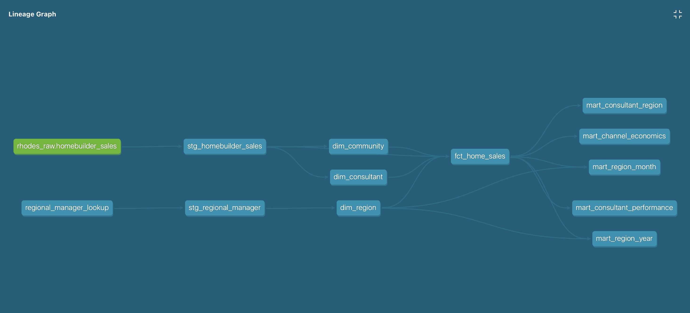
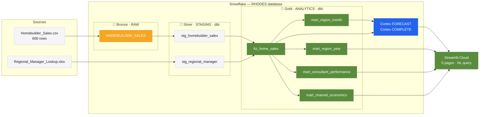
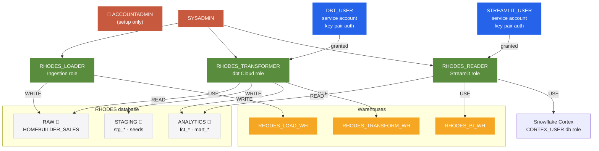

# Rhodes Enterprise Sales Analytics

This project is a take-home data engineering assessment for Rhodes Enterprise, a residential builder operating across three South Texas regions. It covers the full pipeline: raw data ingestion into Snowflake, transformation with dbt, and a five-page Streamlit dashboard that uses Snowflake Cortex for AI forecasting and natural-language queries over the actual data.

## Live Dashboard

https://rhodes.streamlit.app

## Architecture

The pipeline follows a three-layer medallion architecture:
raw data lands in Snowflake unchanged, dbt transforms it into
clean staging models and analytics marts, and Streamlit reads
from the analytics layer.

The Cortex ML models (FORECAST and COMPLETE) run inside Snowflake — no data leaves the warehouse for AI queries.


*dbt lineage: source → staging → dims/fact → aggregate marts*



## Snowflake Access Control

Three functional roles follow a least-privilege pattern. Each role has access only to what it needs — the ingestion script can't read transformed data, and the dashboard can't write anything.



FUTURE GRANTS on all schemas ensure new dbt models automatically inherit the correct permissions without manual re-granting.

## Stack

- Snowflake — data warehouse, Cortex ML (FORECAST + COMPLETE)
- dbt Cloud — transformations, testing, documentation
- Streamlit Cloud — dashboard
- Python — ingestion utilities

## Project Structure

```text
rhodes/
├── dbt/              # dbt project: staging, marts, tests, docs
├── streamlit/        # Streamlit app: 5 pages + utils
├── ingestion/        # Source data and conversion scripts
├── sql/setup/        # Snowflake setup SQL (idempotent)
├── docs/             # Diagrams
└── README.md
```

## Data

The source data is 600 home sale contracts from January 2023 through September 2024, covering three regions: Rio Grande Valley, South Texas, and Coastal Bend. Each row represents one contract with buyer type, loan type, acquisition channel, agent commission, and sale price. A separate regional manager lookup maps communities to regions and managers.

The main CSV was uploaded through the Snowsight UI into `RHODES.RAW.HOMEBUILDER_SALES`. The manager lookup is managed as a dbt seed so it stays version-controlled and gets loaded automatically during `dbt build`.

## dbt Models

| Layer | Models | Purpose |
| --- | --- | --- |
| Staging | stg_homebuilder_sales, stg_regional_manager | Clean and rename source columns |
| Core marts | dim_region, dim_consultant, dim_community, fct_home_sales | Star schema with calculated flags and metrics |
| Aggregate marts | mart_region_month, mart_region_year, mart_consultant_performance, mart_consultant_region, mart_channel_economics | Pre-aggregated for dashboard queries |

158 tests pass across all models and sources, covering not-null, unique, accepted-value, and referential integrity constraints.

## Cortex AI

**Contract volume forecast.** Trained on 21 months of monthly closing history per region. Projects October through December 2024 closings with 90% confidence intervals. On the current trajectory, no region reaches its annual unit target — the Forecast page shows both the projection and the gap.

**Close-time forecast.** Trained on average days-to-close per region. Rio Grande Valley shows a slight projected improvement (~118 days vs. a recent 126-day average). Coastal Bend is excluded from this chart — at 3 to 4 closings per month, the model produces near-zero confidence intervals that would look precise but aren't.

**Natural-language queries.** The Ask a Question page fetches relevant mart data based on keywords in the question, sends it as context to `claude-4-sonnet` via Cortex COMPLETE, and returns a plain-English answer. The raw data context sent to the model is visible in an expander on the page.

## Key Findings

- Coastal Bend closings dropped 38.9% year-over-year (22 vs. 36, same Jan–Sep window). No other region shows this pattern.
- South Texas is closest to its annual target at 72% YTD attainment. Rio Grande Valley is at 63%.
- Realtor Referral is the most expensive acquisition channel (3.0% average commission) and has the second-highest cancellation rate (10.3%). Event/Home Show is the cheapest (2.1%) with the third-lowest cancel rate (3.1%).
- James Whitfield's cancellation rate doubled year-over-year from 7.8% to 15.8%. Ana Garza's dropped from 4.3% to 1.9%.
- All six consultants work across all three regions — no territory specialization shows up in the data.
- Agent commission rates vary meaningfully by acquisition channel (2.1% for Event/Home Show vs 3.0% for Realtor Referral). Combined with cancellation rate differences, channel mix is the clearest margin lever available to regional managers.

## Modeling Decisions

Year-over-year comparisons use the same calendar window in both years (Jan–Sep vs. Jan–Sep), not annualized extrapolation. Annualized figures exist as secondary mart columns for reference, but the headlines compare the same time window because comparing different periods isn't apples-to-apples.

The dataset has no construction cost column — confirmed with the hiring team as intentional. `estimated_margin_pct` is defined as `(contract_price - agent_commission) / contract_price`, a revenue-net-of-commission proxy rather than true gross margin. Agent commission is the only cost column available; it feeds both the margin proxy and the channel commission rate analysis on the Revenue & Channels page.

A cancellation rate forecast model was trained but dropped from the dashboard. Monthly cancel rates are too noisy at the data volumes here — Coastal Bend averages 3 to 8 contracts per month — and showing unreliable projections to a sales director would do more harm than good.

Year boundaries in the dbt marts are derived dynamically from `MAX(contract_date)`, not hardcoded. The only fixed date is `contract_date < '2024-10-01'`, which reflects a known extract boundary in the source data, not a business cutoff.

October 2024 is excluded from all aggregates. The source extract was generated on approximately October 2, 2024 — only one contract was captured that day, making it a partial month. Including it would make October appear as a dramatic volume collapse rather than a data boundary. The exclusion is implemented as `contract_date < '2024-10-01'` with a comment in every affected mart model.

## If I Had More Time

- dbt snapshots for SCD Type 2 — contracts change status over time (Under Contract → Closed or Cancelled). A snapshot model would capture that history and enable cohort analysis.
- Separate dev and prod Snowflake environments with a promotion workflow, instead of the current shared STAGING and ANALYTICS schemas.
- Per-developer dbt schema namespacing so developers don't step on each other.
- A calendar dimension for cleaner period-over-period comparisons.
- CRM integration for the full lead → contract → close funnel — the current data starts at contract signing, so everything upstream (visits, inquiries, follow-ups) is missing.

## Setup

1. Run `sql/setup/01_account_setup.sql` as ACCOUNTADMIN — creates warehouses, schemas, roles, and service users.
2. Run `sql/setup/02_cortex_forecast.sql` as ACCOUNTADMIN — creates the Cortex FORECAST models and stores results.
3. Install dbt dependencies: `dbt deps`
4. Run the full dbt pipeline: `dbt build`
5. Add Streamlit connection secrets: copy `streamlit/.streamlit/secrets.toml.example` to `secrets.toml` and fill in the values.
6. Run locally: `streamlit run streamlit/Home.py`


