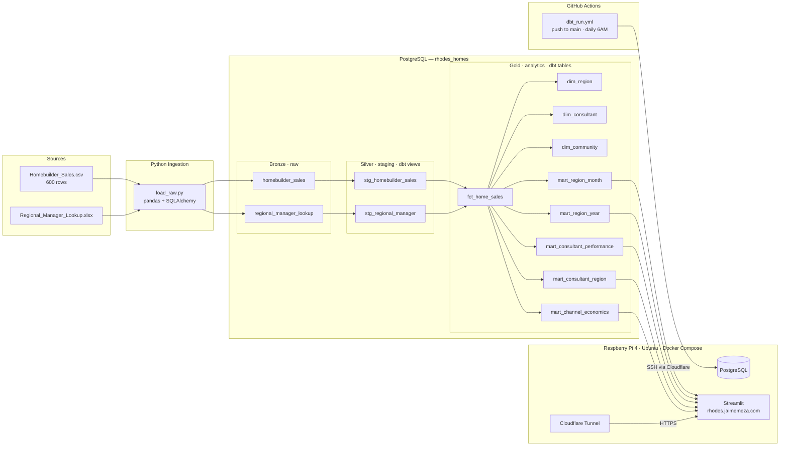

# Rhodes Enterprise Sales Analytics

A full-stack data engineering project built as a take-home assessment for Rhodes Enterprise, a residential homebuilder operating across three South Texas regions. The pipeline covers raw ingestion, dbt transformation, automated orchestration, and a live Streamlit dashboard — all self-hosted on a Raspberry Pi 4.

**Live dashboard:** [rhodes.jaimemeza.com](https://rhodes.jaimemeza.com)

---

## Project Overview

The source data is 600 home sale contracts from January 2023 through September 2024 across three regions: Rio Grande Valley, South Texas, and Coastal Bend. Each row represents one contract with buyer type, loan type, acquisition channel, agent commission, and sale price. A separate regional manager lookup maps communities to regions and managers.

The dashboard surfaces regional performance, year-over-year trends, channel economics, consultant metrics, and a closing volume forecast — updated automatically on every push to main and every morning at 6 AM.

---

## Architecture

The pipeline follows a medallion architecture: raw source data lands in PostgreSQL unchanged, dbt transforms it through staging into analytics marts, and Streamlit reads from the analytics layer.


```mermaid
flowchart LR
    subgraph Sources
        CSV[Homebuilder_Sales.csv<br>600 rows]
        XLSX[Regional_Manager_Lookup.xlsx]
    end

    subgraph Ingestion["Python Ingestion"]
        PY[load_raw.py<br>pandas + SQLAlchemy]
    end

    subgraph Postgres["PostgreSQL — rhodes_homes"]
        direction TB
        subgraph Bronze["Bronze · raw"]
            R1[homebuilder_sales]
            R2[regional_manager_lookup]
        end
        subgraph Silver["Silver · staging · dbt views"]
            S1[stg_homebuilder_sales]
            S2[stg_regional_manager]
        end
        subgraph Gold["Gold · analytics · dbt tables"]
            F1[fct_home_sales]
            D1[dim_region]
            D2[dim_consultant]
            D3[dim_community]
            M1[mart_region_month]
            M2[mart_region_year]
            M3[mart_consultant_performance]
            M4[mart_consultant_region]
            M5[mart_channel_economics]
        end
    end

    subgraph Infra["Raspberry Pi 4 · Ubuntu · Docker Compose"]
        PG[(PostgreSQL)]
        ST[Streamlit<br>rhodes.jaimemeza.com]
        CF[Cloudflare Tunnel]
    end

    subgraph CI["GitHub Actions"]
        GHA[dbt_run.yml<br>push to main · daily 6AM]
    end

    CSV & XLSX --> PY --> R1 & R2
    R1 --> S1
    R2 --> S2
    S1 & S2 --> F1
    F1 --> D1 & D2 & D3
    F1 --> M1 & M2 & M3 & M4 & M5
    M1 & M2 & M3 & M4 & M5 --> ST
    GHA -->|SSH via Cloudflare| PG
    CF -->|HTTPS| ST
```

---

## Stack

| Layer | Technology |
| --- | --- |
| Ingestion | Python 3.12, pandas, SQLAlchemy |
| Warehouse | PostgreSQL 16 (self-hosted) |
| Transformation | dbt Core 1.x — 11 models, 168 tests |
| Orchestration | GitHub Actions (push + daily cron) |
| Visualization | Streamlit — 5 pages |
| Forecasting | scikit-learn linear regression |
| Infrastructure | Raspberry Pi 4, Ubuntu, Docker Compose |
| Networking | Cloudflare Tunnel (no open ports) |

---

## Pipeline: End to End

### 1. Ingestion

`ingestion/load_raw.py` reads the CSV and XLSX source files with pandas, lowercases column names, and writes them to the `raw` schema in PostgreSQL via SQLAlchemy. The table is replaced on every run — the raw layer is not append-only.

### 2. dbt Transformation

dbt runs three steps in sequence:

- `dbt seed` — loads the regional manager lookup from `seeds/` into the staging schema
- `dbt run` — materializes 11 models across three layers:
  - **Staging (views):** `stg_homebuilder_sales`, `stg_regional_manager` — clean and rename source columns
  - **Core (tables):** `fct_home_sales`, `dim_region`, `dim_consultant`, `dim_community` — star schema with calculated flags and metrics
  - **Aggregate marts (tables):** `mart_region_month`, `mart_region_year`, `mart_consultant_performance`, `mart_consultant_region`, `mart_channel_economics` — pre-aggregated for dashboard queries
- `dbt test` — runs 168 tests covering not-null, unique, accepted-value, and referential integrity constraints

### 3. Orchestration

A GitHub Actions workflow (`.github/workflows/dbt_run.yml`) triggers on every push to `main` and on a daily cron at 06:00 UTC. It installs `cloudflared`, opens an SSH tunnel to the Pi through the Cloudflare network, and runs the full pipeline remotely — no inbound ports required.

### 4. Forecasting

The Forecast page fits a linear regression (scikit-learn) on monthly closing history per region and projects forward with 90% confidence intervals. This replaced an earlier Snowflake Cortex ML integration after the infrastructure moved to self-hosted PostgreSQL.

### 5. Visualization

Streamlit reads from the analytics marts via a PostgreSQL connection utility (`streamlit/utils/postgres.py`). The app runs in a Docker container on the Pi, served over HTTPS through the Cloudflare Tunnel.

| Page | Content |
| --- | --- |
| Home | KPI summary cards |
| Region Overview | Monthly closings, YoY comparison by region |
| Forecast | Projected closings through end of year |
| Channel Economics | Commission rates, cancel rates by acquisition channel |
| Consultants | Per-consultant performance and YoY trends |

---

## Project Structure

```text
rhodes/
├── .github/workflows/    # GitHub Actions CI/CD
├── dbt/
│   ├── models/
│   │   ├── staging/      # 2 staging views
│   │   └── marts/
│   │       ├── core/     # fact + 3 dims
│   │       └── agg/      # 5 aggregate marts
│   ├── seeds/            # Regional manager lookup
│   └── dbt_project.yml
├── ingestion/
│   ├── load_raw.py       # CSV/XLSX → PostgreSQL raw schema
│   ├── seed_data/        # Source files
│   └── requirements.txt
├── streamlit/
│   ├── Home.py
│   ├── pages/            # 4 dashboard pages
│   └── utils/            # DB connection, queries, styles
├── docker-compose.yml    # Streamlit container
└── README.md
```

---

## Local Setup

**Prerequisites:** Python 3.12+, PostgreSQL, dbt Core

### 1. Clone and install dependencies

```bash
git clone https://github.com/jaimemeza/rhodes.git
cd rhodes
```

### 2. Start PostgreSQL and create the database

```bash
createdb rhodes_homes
```

### 3. Run ingestion

```bash
cd ingestion
pip install -r requirements.txt
DATABASE_URL="postgresql://<user>:<pass>@localhost:5432/rhodes_homes" python load_raw.py
```

### 4. Configure dbt

Create `dbt/profiles.yml` (not committed):

```yaml
rhodes_analytics:
  target: dev
  outputs:
    dev:
      type: postgres
      host: localhost
      port: 5432
      user: <your_user>
      password: <your_password>
      dbname: rhodes_homes
      schema: analytics
```

### 5. Run dbt

```bash
cd dbt
dbt deps
dbt seed
dbt run
dbt test
```

### 6. Run Streamlit

```bash
cd streamlit
pip install -r requirements.txt
```

Create `.streamlit/secrets.toml`:

```toml
[postgres]
host = "localhost"
port = 5432
dbname = "rhodes_homes"
user = "<your_user>"
password = "<your_password>"
```

```bash
streamlit run Home.py
```

---

## Key Findings

- Coastal Bend closings dropped 38.9% year-over-year (22 vs. 36, same Jan–Sep window). No other region shows this pattern.
- South Texas is closest to its annual target at 72% YTD attainment. Rio Grande Valley is at 63%.
- Realtor Referral is the most expensive acquisition channel (3.0% avg commission) with the second-highest cancellation rate (10.3%). Event/Home Show is the cheapest (2.1%) with the third-lowest cancel rate (3.1%).
- Agent commission rates vary by over 40% across channels (2.1% to 3.0%). Combined with cancellation rate differences, channel mix is the clearest margin lever available to regional managers.
- James Whitfield's cancellation rate doubled year-over-year from 7.8% to 15.8%. Ana Garza's dropped from 4.3% to 1.9%.

---

## Modeling Decisions

Year-over-year comparisons use the same calendar window in both years (Jan–Sep vs. Jan–Sep), not annualized extrapolation. The dataset has no construction cost column — `estimated_margin_pct` is defined as `(contract_price - agent_commission) / contract_price`, a revenue-net-of-commission proxy. Year boundaries in the dbt marts are derived dynamically from `MAX(contract_date)`.

October 2024 is excluded from all aggregates (`contract_date < '2024-10-01'`). The source extract was generated around October 2 — only one contract was captured, making it a partial month that would appear as a dramatic volume collapse rather than a data boundary.
